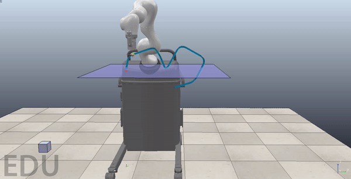

# LBR_interface #
_Repository for group ROB1063b - Master Thesis at Aalborg University_

Project description:

**Title:** Adaptive trajectory generation with workspace restrictions for clinical applications

**Author:** Carolina Gomez Salvatierra ()

**Supervisor(s):** Dimitris , Sebastian Hjorth

**Time period:** 3rd February - 3rd June 2021

**Abstract:**

Collaborative robotics and healthcare have progressed in the last decades, being now in a wide topic with multiple branches, such as surgery, laboratory robots, exoskeletons, prosthesis, therapy and much more.
In the case of therapy, collaborative robots are already in use for rehabilitation and available for different application types, e.g. for improving the rehabilitation in lower or upper limbs.

In this project the focus relies on the workspace restrictions on rehabilitation exercises, in order to prevent the patient from doing exercises trajectories incorrectly and potentially deviating the manipulator from its goal position towards an non-allowed space.
Overall, the workspace restrictions have been done using an approach based on virtual constraints and in case of not letting the patient deviate the robot, it is based on the cooncept of Artificial Potential Field.

From a practical point of view, the project was developed in order to improve the robotic platform called ROBERT, a collaborative assistant used by therapists, mostly on the recovery from stroke patients.

ROBERT is a platform with a Kuka LBR Med on the top, which has an end-effector that can be attached to the patient's leg with a tool. Afterwards, the robot helps the patient to complete physical routines.

The main goal of this project is to provide a proof of concept  under a new perspective on path planning for manipulators in clinical applications.

## Repository organization ##

The files used for this project are divided in different directories:

* _kuka files_: directory with a Kuka Sunrise project, containing all the implementation done in a Kuka LBR Med manipulator in a ROBERT platform.
* _matlab_: directory with MATLAB scripts, used for Artificial Potential Field development, such as path correction, calculating lambda and beta ratios or plotting recorded data from the robot. 
* _modelling_: ROBERT CAD and URDF-STL files that were used to build the ROBERT simulation model.
* _recording_: path and trajectories recorded on ROBERT with hand-guiding.
* _simulation_: CoppeliaSim files, including the models, control remote options and simulation scenes.

For further details, take a look on the README.md files the _matlab_ and _simulation_ directories.

### Project application overview ###

What this project is meant to do (more or less):

1. Record a path by hand-guiding on a ROBERT unit.
2. Transfer the recorded path to CoppeliaSim in order to be checked.
3. The simulation ROBERT will move the robot along the corrected path, taking into account the present virtual constraints.
4. The real ROBERT will move following the simulator. 
On the run, the controller gains and the motion velocity depends on the patient's push force.

### Others ###

Here are some basic features of the project that can be re-used for other projects:

* The simulation robot follows the real ROBERT.

* The real robot follows the simulation model.

* Path correction using an APF.

* Interaction between a patient and the robot in simulation.

### Requisites ###

* For the Kuka LBR Med: Kuka Sunrise OS Workbench.
* For the simulation model: CoppeliaSim EDU Version, and SolidWorks 2019 (for modifying the simulation model).
* For analysing and plotting data: MATLAB R2019b + Robotics, Curve-fitting toolbox 