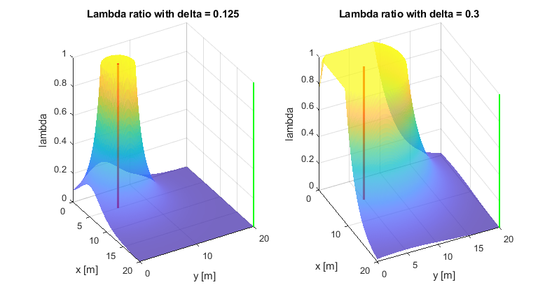
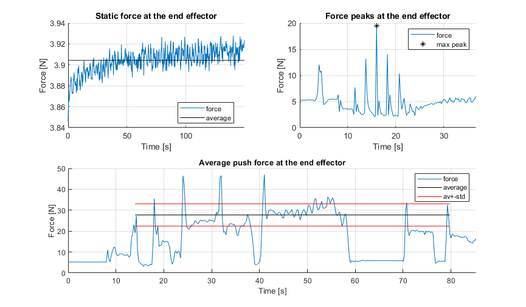
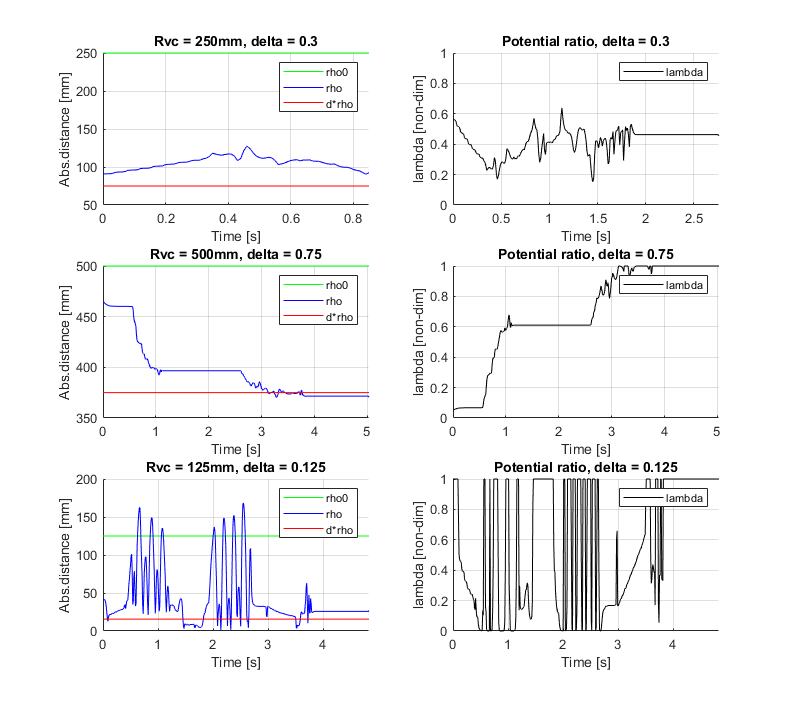

# MATLAB Directory #

This directory contains all the files and functions to analyse the Artificial Potential Field (APF) approach, the generated data from the robot and other approaches.
The directories contained here are:

* _coppelia remote:_ an old apporach, which consisted on accessing to information from the simulation scene in CoppeliaSim through the Remote API given by Coppelia. 
This directory contains an example and all the Matlab files dependencies in order to do so from Matlab side. 
The communication in this approach worked, but it was discarded because the dynamics information is not included in this API (e.g. accessing to torques and forces) due to the fact that in CoppeliaSim the object dynamics come from the physics engine and that is not accessible from the Remote API.
* _Ubuntu:_ an old approach, which consisted on accessing the information from the simulaation scene in CoppeliaSim through a ROS master. 
This was done in order to coordinate the simulation running in an Ubuntu computer with the real robot. This was done in order to get access to the joint torques and the forces at the end-effector. 
This approach worked, but it was discarded because it was too slow and it only works on an Ubuntu OS.
* _Windows:_ final approach. It has the main scripts for the APF approach and plotting. It is sub-divided in the following directories:

1. (main folder) : scripts and images.
2. _energy:_ APF approach.

3. _model urdf:_ old approach. This is the manipulator Kuka LBR Med from SolidWorks imported and using motions in Matlab.

4. _robert urdf:_ old approach. This is the complete ROBERT platfrom from SolidWorks imported and using motions in Matlab. This and the previous models were discarded when the model started to work successfully in CoppeliaSim.

5. _trajectory:_ force-velocity methods and recordings.

6. _vwall:_ virtual constraints, application of the APF methods and recordings

__________________________________________________________________________________

##### Acknowledgement #####

The robot modelling and path interpolation through waypoints are functions based on another project for the UR3e:

[ur3e-modelling  respository](https://bitbucket.org/aauomniplatform/ur3e-modelling/src/master/)

__________________________________________________________________________________